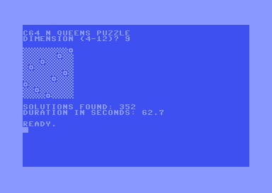

# C64 N Queens puzzle
A C64-6502 assembler implementation of an algorithm to solve the famous [eight queens puzzle](https://en.wikipedia.org/wiki/Eight_queens_puzzle).

This is a generic implementation able to solve and find all solutions for N in the range 4 to 12.

Download PRG file from [here](build/main.prg) 

### VSCode template

Check [github repo](https://github.com/Esshahn/acme-assembly-vscode-template) for setup instructions & help

